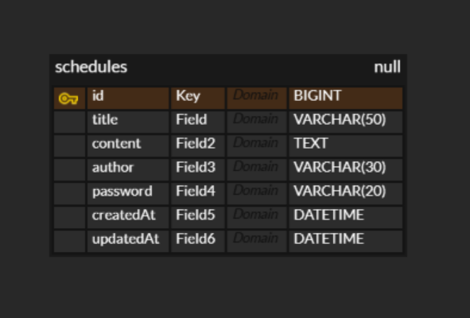

## ERD

필드명타입옵션
idBIGINTPK, AUTO_INCREMENTtitleVARCHAR(50)contentTEXTauthorVARCHAR(30)passwordVARCHAR(20)createdAtDATETIMEupdatedAtDATETIME

## API 목록
API명MethodURL일정 생성POST/schedules전체 일정 조회GET/schedules단건 일정 조회GET/schedules/{id}일정 수정PUT/schedules/{id}일정 삭제DELETE/schedules/{id}

상세 명세
## 일정 생성

Method : POST
URL : /schedules

Request
json{
"title": "일정 제목",
"content": "일정 내용",
"author": "작성자 이름",
"password": "비밀번호"
}
Response
json{
"id": 1,
"title": "일정 제목",
"content": "일정 내용",
"author": "작성자 이름",
"createdAt": "2024-01-01T00:00:00",
"updatedAt": "2024-01-01T00:00:00"
}

## 전체 일정 조회

Method : GET
URL : /schedules

Request : 없음
Response
json[
{
"id": 1,
"title": "일정 제목",
"content": "일정 내용",
"author": "작성자 이름",
"createdAt": "2024-01-01T00:00:00",
"updatedAt": "2024-01-01T00:00:00"
}
]

## 단건 일정 조회

Method : GET
URL : /schedules/{id}

Request : 없음
Response
json{
"id": 1,
"title": "일정 제목",
"content": "일정 내용",
"author": "작성자 이름",
"createdAt": "2024-01-01T00:00:00",
"updatedAt": "2024-01-01T00:00:00"
}

## 일정 수정

Method : PUT
URL : /schedules/{id}

Request
json{
"title": "수정할 제목",
"content": "수정할 내용",
"password": "비밀번호"
}
Response
json{
"id": 1,
"title": "수정할 제목",
"content": "수정할 내용",
"author": "작성자 이름",
"createdAt": "2024-01-01T00:00:00",
"updatedAt": "2024-01-01T00:00:00"
}

## 일정 삭제

Method : DELETE
URL : /schedules/{id}

Request
json{
"password": "비밀번호"
}
Response : 204 No Content
